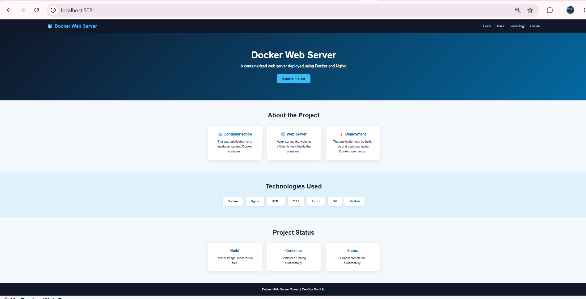
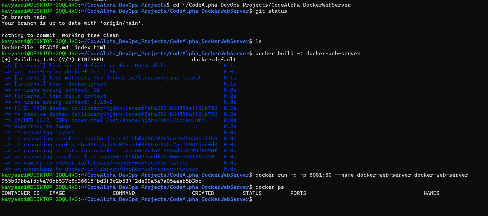

# CodeAlpha Docker Web Server

## Project Overview

A simple web server deployed inside a Docker container using Nginx.

The project demonstrates how to create a Docker image, run an Nginx web server inside a Docker container, map the container port to the host machine, and serve a custom HTML/CSS webpage.

## Architecture

```text
Client Browser
      |
      | localhost:8081
      v
Docker Container
      |
      v
Nginx Web Server
      |
      v
index.html
```

## Technologies Used

* Linux / Ubuntu
* Docker
* Nginx
* HTML
* CSS
* Git
* GitHub

## Docker Concepts Practiced

* Docker images
* Docker containers
* Dockerfile
* Docker build
* Docker run
* Port mapping
* Container lifecycle
* Container logs
* Container monitoring
* Troubleshooting

## Dockerfile

The Dockerfile uses the official Nginx image as the base image and copies the custom HTML webpage into the Nginx web directory.

## Build the Image

```bash
docker build -t docker-web-server .
```

## Run the Container

```bash
docker run -d -p 8081:80 --name docker-web-server docker-web-server
```

## Check the Running Container

```bash
docker ps
```

## Access the Web Server

Open the following URL in a browser:

```text
http://localhost:8081
```

The custom webpage is served by Nginx from inside the Docker container.

## Useful Docker Commands

```bash
docker images
docker ps
docker logs docker-web-server
docker stop docker-web-server
docker start docker-web-server
docker rm docker-web-server
```

## Screenshots

### Docker Webpage

The custom webpage running inside the Docker container:



### Docker Commands

Docker image build, container execution, and container status:



## Result

Successfully deployed and accessed a custom web page through an Nginx web server running inside a Docker container.

## Key DevOps Concepts

* Containerization
* Docker image creation
* Container management
* Nginx web server
* Port mapping
* Linux command-line operations
* Basic troubleshooting
* Git and GitHub

## Internship Project

**CodeAlpha — Docker Web Server Project**

